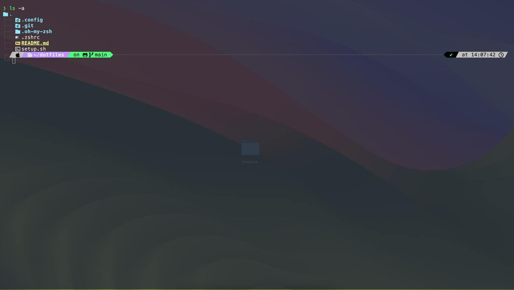

# Dotfiles

## Обзор

Добро пожаловать в мой репозиторий dotfiles! Этот набор конфигурационных файлов разработан для улучшения вашего опыта работы с терминалом, сочетая в себе эстетику и функциональность. Независимо от того, являетесь ли вы разработчиком, системным администратором или просто любителем хорошо настроенной среды, эти dotfiles стремятся сделать ваш рабочий процесс более плавным и приятным.

## Особенности

### Конфигурация Терминала

- **Kitty Terminal**: Стильный и высококастомизируемый эмулятор терминала. Моя конфигурация включает оптимизированные настройки для производительности и эстетики, обеспечивая беспрепятственный и визуально привлекательный опыт.
  

### Конфигурация Оболочки

- **Zsh с Oh-My-Zsh**: Мощная и расширяемая оболочка с богатым набором плагинов и тем. Моя конфигурация использует Oh-My-Zsh для предоставления функциональной и настраиваемой среды оболочки.
  - **Используемые плагины**:
    - **z**: Ускоряет навигацию по файловой системе, запоминая часто посещаемые директории.
    - **git**: Добавляет множество удобных alias и функций для работы с Git.
    - **docker**: Упрощает работу с Docker, предоставляя удобные команды и автодополнение.
    - **fzf**: Интерактивный инструмент для быстрого поиска файлов, команд и истории.
    - **zsh-autosuggestions**: Автоматически предлагает команды на основе истории и автодополнения.
    - **zsh-syntax-highlighting**: Подсвечивает синтаксис команд в реальном времени, что упрощает их чтение и исправление.
    - **history**: Улучшает работу с историей команд, предоставляя удобные функции для поиска и повторения команд.
- **The Fuck**: Удобная утилита, которая исправляет вашу предыдущую консольную команду простым нажатием `fuck`. Больше не будет раздражения из-за опечаток!

### Конфигурация Редактора

- **Neovim с LazyVim**: Высококастомизированная настройка Neovim, построенная на основе фреймворка LazyVim. Эта конфигурация предлагает красивый и эффективный опыт редактирования текста, с плагинами и сочетаниями клавиш, адаптированными для повышения производительности.
  - **Заточена под Python-разработку**: Включает плагины и настройки, оптимизированные для разработки на Python, такие как поддержка LSP, форматирование, линтинг и автодополнение.

### Предстоящие Особенности

- **Интеграция SSH Manager**: Планирую интегрировать свой [SSH Manager](https://github.com/ProFastCode/ssh-manager.git) в этот репозиторий. Это предоставит удобный способ управления вашими SSH-соединениями прямо из терминала или в Neovim.

## Установка

Чтобы начать работу с этими dotfiles, просто запустите скрипт установки:

```sh
./setup.sh
```

Этот скрипт автоматически настроит вашу среду с предоставленными настройками.

## Поддержка

Если у вас возникнут какие-либо проблемы во время установки или у вас есть вопросы, не стесняйтесь обращаться ко мне в Telegram: [@ProFastCode](https://t.me/@ProFastCode).

## Вклад

Я приветствую вклады! Если у вас есть предложения по улучшению или новые функции, пожалуйста, откройте issue или отправьте pull request.

## Лицензия

Этот проект лицензирован под MIT License. Подробности смотрите в файле [LICENSE](LICENSE).

---

Наслаждайтесь вашей новой, красиво настроенной средой! 🚀
